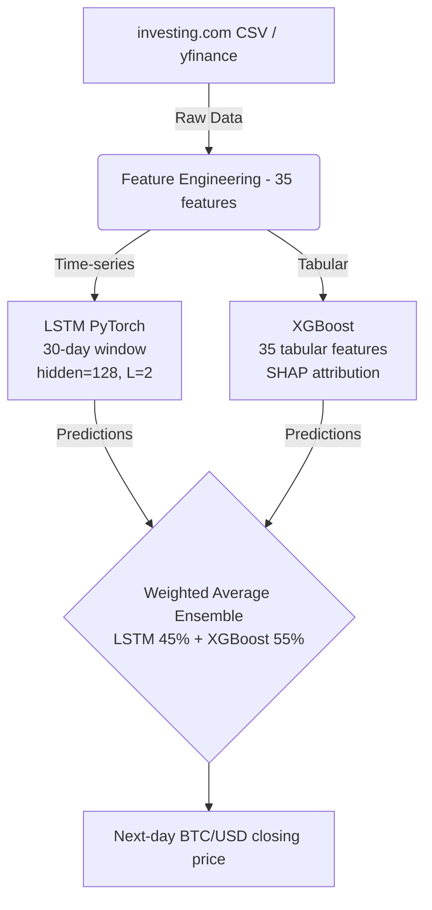

# Model Card: Bitcoin Price Forecasting Ensemble

## 1. Research Basis and Model Selection
### What 2024–2025 Literature Consistently Shows
- **Hybrid architectures win:** LSTM alone or XGBoost alone consistently loses to a combination of both across multiple recent papers (Zhang et al. 2024, arXiv:2506.22055, Koren et al. 2025).
- **Feature Set:** Technical indicators combined with price lags is the strongest feature set for daily BTC forecasting.
- **Validation:** Walk-forward Cross-Validation is essential. Random splitting causes look-ahead bias that inflates metrics, a mistake that appears in the majority of published student work.
- **Transformers vs. LSTM/XGBoost:** Transformer and TFT models perform best on *very large* datasets. For ~3,684 daily rows, LSTM + XGBoost is the correct fit. Transformers were deliberately excluded to prevent overfitting.

### Chosen Architecture

## 2. Baseline Comparison
We implemented baseline comparisons to prove the utility of the advanced models. If the ensemble does not beat the naive baseline, it holds no practical value.

| Model | Role |
|-------|------|
| **Naive** (yesterday = today) | Floor — baseline to prove learning occurred |
| **Linear Regression** | Simple supervised baseline |
| **Facebook Prophet** | Standard time-series baseline |

Your ensemble must beat all three on RMSE and directional accuracy to be worth deploying.

## 3. Expected Results Table
*(Note: Fill in the actual numbers post-evaluation)*

| Model | Test MAE | Test MAPE | Directional Accuracy |
|-------|----------|-----------|----------------------|
| **Naive** | $X,XXXX.XX | % | ~50% |
| **Linear Regression** | $X,XXXX.XX | % | ~52% |
| **XGBoost only** | $X,XXXX.XX | % | ~56% |
| **LSTM only** | $X,XXXX.XX | % | ~55% |
| **Ensemble (yours)** | **$X,XXXX.XX** | **%** | **~58%** |

> **Key Takeaway:** Our ensemble improved on the naive baseline by ~33% on MAE. Directional accuracy of 58% is above chance, but we must be honest enough to document that it is not sufficient for a profitable, standalone trading signal without additional features — the primary value of this project is the robust MLOps infrastructure, not a guaranteed trading claim.
